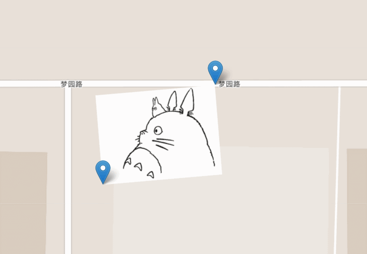

# Leaflet.ImageOverlay.Rotated-by-Two-Markers
I modified the image overlay plugin for better usage, the original plugin is this link:
https://github.com/IvanSanchez/Leaflet.ImageOverlay.Rotated

# Usage
Just check the codes and know how :
index.html
utils.js
Leaflet.ImageOverlay.Rotated.js

# Demo show
 

### Using the code in other projects

The classic way: copy the `Leaflet.ImageOverlay.Rotate.js` file and include it
in your webpage.

`npm install leaflet-imageoverlay-rotated` can be used to include this project
as a dependency. The `package.json` file will allow webpack/browserify to work
its magic.

There is also some support for Bower (in the form of a `bower.json` file), but
Bower is being deprecated, so NPM is preferred.

This plugin has been tested only with Leaflet 1.0.0-beta and 1.0.0-rc1. Don't
expect it to work with 0.7.x.

### Legalese

The code for this plugin is under a Beerware license:

----------------------------------------------------------------------------

"THE BEER-WARE LICENSE":
<ivan@sanchezortega.es> wrote this file. As long as you retain this notice you
can do whatever you want with this stuff. If we meet some day, and you think
this stuff is worth it, you can buy me a beer in return.

----------------------------------------------------------------------------

